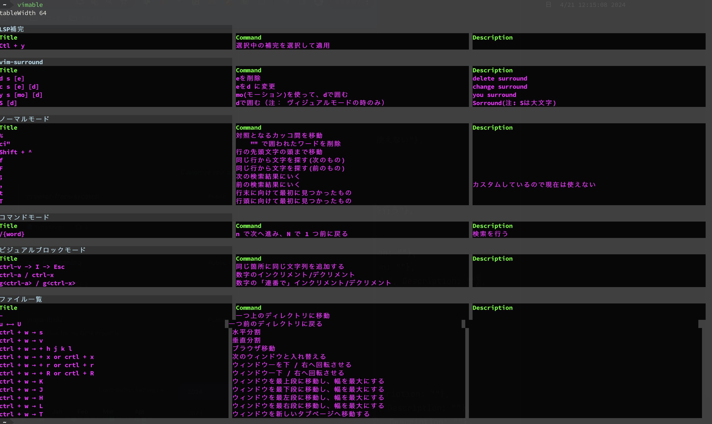

## Overview

What do you do when you forget the vim command to do something?

## install
```shell
$ go install github.com/yugo-ibuki/vimable@latest
```

## command

```shell
$ vimable
```

## sample image




